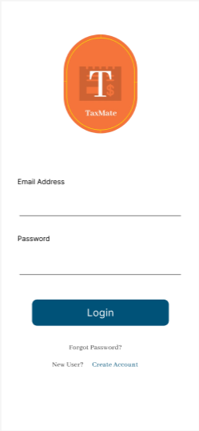
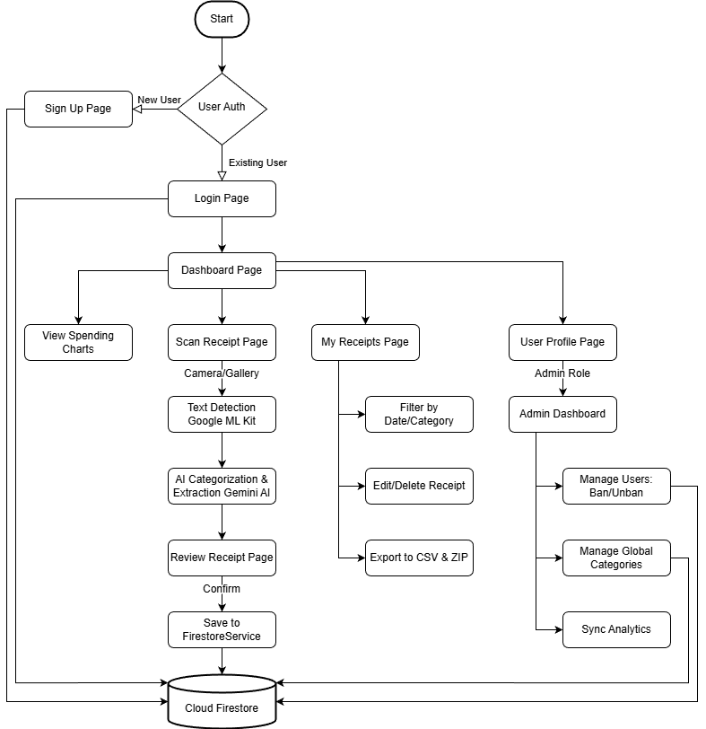

# Digital Receipt Management 

---

## Introduction
This is a mobile application designed to revolutionize tax related receipt management for Malaysian taxpayers. This app digitizes physical receipts, automatically categorizes expenses using AI and OCR technology, and seamlessly integrates with LHDN's e-Filing system to simplify tax filing and ensure compliance with record-keeping requirements.

### Problem Description
In Malaysia, the Inland Revenue Board (Lembaga Hasil Dalam Negeri Malaysia, LHDN) has implemented the e-Filing system, enabling taxpayers to submit their Income Tax Return Forms (ITRF) electronically. Despite this advancement, taxpayers are still required to retain original source documents, such as invoices and receipts, for a period of seven years for verification purposes.

The traditional method of storing physical receipts is often cumbersome, prone to loss or damage, and can lead to disorganized record-keeping, making the tax filing process more challenging. Physical receipts printed on thermal paper can fade over time, leading to potential loss of critical information, and accessing them requires manual effort, which can be time-consuming, especially during tax season.

### Motivation
The current process of managing tax-related receipts presents several specific problems:

- **Risk of Loss or Damage**: Physical receipts are susceptible to being lost, damaged, or becoming illegible over time, hindering taxpayers' ability to provide necessary documentation during audits.

- **Time-Consuming Retrieval**: Manually searching through piles of receipts to find specific documents for tax deductions is inefficient and can lead to missed deductions due to overlooked receipts.

- **Lack of Categorization**: Without a systematic approach, taxpayers may struggle to categorize expenses accurately, potentially leading to errors in tax filings or missed opportunities for tax reliefs.

- **Storage Limitations**: Accumulating years' worth of physical receipts requires substantial storage space and can become unmanageable.

### Relevance
This project addresses a real-world problem faced by Malaysian taxpayers by leveraging technology to digitize, categorize, and store receipts securely. By digitizing receipt management and integrating with LHDN's e-Filing system, this application aims to enhance the efficiency and accuracy of the tax filing process, reduce the reliance on physical document storage, and support taxpayers in maintaining comprehensive and organized financial records.

---

## Objectives of the Proposed Mobile App

The primary objective of this project is to develop a mobile application that digitizes and streamlines the management of tax-related receipts for Malaysian taxpayers, thereby enhancing compliance with LHDN's requirements and simplifying the tax filing process. The specific objectives are:

1. **Digital Receipt Storage**: Enable users to securely scan and store receipts in a cloud-based system, reducing the reliance on physical document storage and mitigating the risk of loss or damage.

2. **Automated Expense Categorization**: Utilize Optical Character Recognition (OCR) and Artificial Intelligence (AI) technologies to extract relevant information from scanned receipts and suggest appropriate tax-deductible categories, such as medical expenses, education fees, and lifestyle expenses.

3. **Efficient Retrieval and Export**: Provide users with the ability to easily retrieve stored receipts and export them in a consolidated format (e.g., .ZIP file) for a selected tax year, facilitating prompt submission to LHDN when required.

4. **User-Friendly Interface**: Design an intuitive and accessible user interface that simplifies the process of receipt management, making it convenient for users to scan, categorize, and retrieve receipts.

---

## Target Users

The primary target users for this application are **Malaysian taxpayers**, including:

| User Group | Description |
|------------|-------------|
| **Age Group** | Individuals aged 18 and above who are engaged in taxable employment or business activities |
| **Professionals** | Salaried employees across various industries who are required to file personal income taxes |
| **Small Business Owners & Entrepreneurs** | Individuals managing small to medium-sized enterprises (SMEs) who need to maintain organized records of business expenses for tax purposes |
| **Freelancers & Gig Economy Workers** | Self-employed individuals and gig workers who may have irregular income streams and diverse expenses requiring meticulous tracking for tax deductions |
| **Families** | Households aiming to manage and categorize shared expenses to maximize tax reliefs and deductions |

---

## Features and Functionalities

### Core Modules

#### 1. User Authentication
- Secure account creation and login processes
- Data privacy protection
- Personalized user experiences

#### 2. Receipt Digitization
- Camera integration for scanning physical receipts
- Conversion to digital formats for storage
- Image quality optimization

#### 3. Data Extraction and Categorization
- **OCR Technology**: Extract pertinent information from scanned receipts (merchant name, date, amount, items)
- **AI-Powered Categorization**: Analyze extracted data to suggest appropriate tax-deductible categories:
  - Medical expenses
  - Education fees
  - Insurance contributions
  - Lifestyle expenses
- User confirmation and manual override options

#### 4. Cloud-Based Storage
- Secure storage of digitized receipts
- Data integrity and accessibility
- Backup and synchronization across devices

#### 5. Receipt Management
- Organize, search, and retrieve stored receipts
- Filter by date, category, or amount
- Edit and update receipt information
- Delete unwanted receipts

#### 6. Export Functionality
- Compile selected receipts into consolidated file formats
- Export as .ZIP or PDF files
- Year-based selection for LHDN submission
- Quick sharing capabilities

#### 7. User Notifications
- Automated reminders for upcoming tax filing deadlines
- Prompts to scan and categorize new receipts
- System updates and maintenance notifications

### UI Components

- **Dashboard**: Overview of receipt statistics, categories, and recent uploads
- **Camera Interface**: Intuitive scanning interface with guides and tips
- **Receipt List**: Organized view with filtering and sorting options
- **Receipt Detail View**: Full receipt information with image preview
- **Category Management**: Visual representation of expense categories
- **Export Screen**: Selection interface for generating export files
- **Profile/Settings**: User preferences, account management, and help center

---

## Proposed UI Mock-up

Below are the key screen designs that illustrate the user interface of the application:

### Authentication Screen
The authentication interface provides secure login and registration functionality for users to access their account.

### Dashboard
The dashboard offers users a comprehensive overview of their receipt management activities, including statistics, recent uploads, and quick access to key features.

---

## Architecture / Technical Design

### Development Framework
The application will be developed as a **cross-platform mobile app** to ensure broad accessibility and user convenience.

### Widget/Component Structure

The application is organized into modular components that work together to provide a seamless user experience.

**Authentication Module**: Handles user registration, login, and password recovery to ensure secure access to the application.
- a. Login Screen
- b. Registration Screen
- c. Password Reset Screen

**Dashboard Screen**: Provides users with an overview of their receipt management activities and quick access to key functions.
- a. Statistics Widget
- b. Recent Receipts Widget
- c. Quick Action Buttons

**Receipt Scanner Module**: Enables users to capture and process physical receipts using their device camera.
- a. Camera Component
- b. Image Preview Component
- c. OCR Processing Component

**Receipt Management Module**: Allows users to view, organize, and manage their digitized receipts.
- a. Receipt List Component
- b. Filter/Sort Component
- c. Receipt Detail Screen
- d. Edit Receipt Component

**Category Management Module**: Helps users organize receipts by tax-deductible categories and visualize spending patterns.
- a. Category Overview
- b. Category Details
- c. Expense Charts

**Export Module**: Facilitates the compilation and export of receipts for tax submission purposes.
- a. Date Range Selector
- b. Receipt Selection Component
- c. Export Format Selector

**Profile/Settings Module**: Manages user account information, preferences, and application settings.
- a. User Profile Component
- b. Settings Options
- c. Help/Support Component

**Common Components**: Reusable UI elements used throughout the application for consistency.
- a. Loading Indicators
- b. Error Boundaries
- c. Alert/Dialog Components
- d. Custom Buttons/Inputs

### State Management Approach

1. **Global State**:
   - User authentication status
   - User profile information
   - App settings and preferences
   - Network connectivity status

2. **Feature-Specific State**:
   - Receipt list data
   - Category information
   - Filter and sort preferences
   - Export selections

3. **Local Component State**:
   - Form inputs
   - UI interactions (modals, dropdowns)
   - Loading states for individual operations

---

## Data Model

### Entity Relationship Diagram (ERD) 

**Entities:**

1. **User**
   - Primary Key: userId
   - Attributes: email, displayName, createdAt, lastLogin, preferences

2. **Receipt**
   - Primary Key: receiptId
   - Foreign Key: userId
   - Attributes: imageUrl, merchantName, amount, date, category, taxDeductible, items, extractedData, tags, notes

3. **Category**
   - Primary Key: categoryId
   - Attributes: name, description, icon, taxDeductible, lhdnCode, keywords

4. **Export**
   - Primary Key: exportId
   - Foreign Key: userId
   - Attributes: taxYear, format, receiptCount, totalAmount, downloadUrl, createdAt

**Relationships:**

- **User ↔ Receipt**: One-to-Many (One user can have many receipts)
- **Category ↔ Receipt**: One-to-Many (One category can be assigned to many receipts)
- **User ↔ Export**: One-to-Many (One user can create many exports)

### Data Access Patterns

1. **Retrieve all receipts for a user**: Query `users/{userId}/receipts`
2. **Filter receipts by category**: Query with `where('category', '==', categoryId)`
3. **Filter receipts by date range**: Query with `where('date', '>=', startDate).where('date', '<=', endDate)`
4. **Get receipts for specific tax year**: Query with `where('taxYear', '==', year)`
5. **Recent receipts**: Query with `orderBy('createdAt', 'desc').limit(10)`

---

## Technology Stack Summary

| Component | Technology |
|-----------|------------|
| **Frontend Framework** | React Native / Flutter |
| **Programming Language** | JavaScript/TypeScript / Dart |
| **Backend** | Node.js (Express.js) / Django (Python) |
| **Database** | Firebase Firestore / Amazon DynamoDB |
| **Cloud Storage** | Firebase Storage / AWS S3 / Google Cloud Storage |
| **OCR Service** | Tesseract / Google Vision API |
| **AI/ML** | TensorFlow Lite / Custom ML Models |
| **Authentication** | Firebase Auth / JWT |
| **State Management** | Provider/Riverpod/Bloc (Flutter) / Redux/Context API (React Native) |

---

## Flowchart or Sequence Diagram

The following flowchart illustrates the user interaction and navigation flow throughout the application:

The flowchart demonstrates the complete user journey from authentication through receipt scanning, categorization, management, and export processes, showing how users interact with various modules and the decision points throughout the application flow.

---
